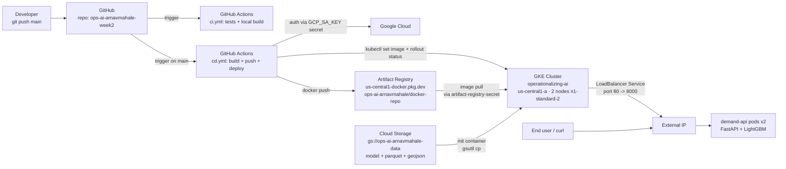

# Architecture

End-to-end flow from a `git push` to a live API request.

## Components

| Component | Identifier | Role |
|---|---|---|
| GitHub repo | `ops-ai-arnavmahale-week2` (private) | source of truth, triggers CI/CD |
| GitHub Secret | `GCP_SA_KEY` | service account JSON for GCP auth |
| GCP project | `ops-ai-arnavmahale` | billing + IAM boundary |
| GCS bucket | `gs://ops-ai-arnavmahale-data` | model artifacts, parquet data, geojson |
| Artifact Registry | `us-central1-docker.pkg.dev/ops-ai-arnavmahale/docker-repo` | versioned Docker images (`:latest` + `:<sha>`) |
| GKE cluster | `operationalizing-ai` (us-central1-a) | 2-node autoscale 2-5, n1-standard-2 |
| K8s Deployment | `demand-api` | 2 replicas, rolling updates, readiness + liveness probes |
| K8s Service | `demand-api` (LoadBalancer) | exposes external IP on port 80 → pod port 8000 |
| K8s Secret | `artifact-registry-secret` | docker-registry creds for pulling images |
| K8s Secret | `gcs-sa-key` | service account key mounted into init container |
| K8s ConfigMap | `demand-api-config` | `GCS_BUCKET` env var |
